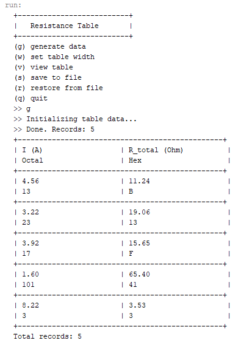
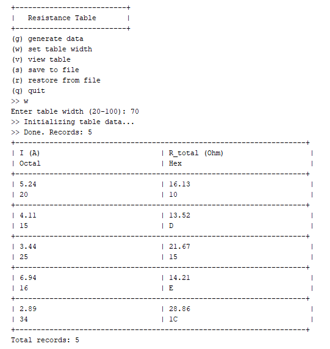

<div align="center">

# 🌸 Завдання 4


</div>

---

> У цьому завданні проект розширено похідними класами ViewTable та ViewableTable.
> Продемонстровано overriding, overloading та поліморфізм на основі
> обчислення загального опору провідників.

---

## 🎀 Постановка задачі

### Індивідуальне завдання №17
Визначити **8-річне та 16-річне** уявлення цілісного значення загального
електричного опору трьох послідовно з'єднаних провідників при заданому
постійному струмі та відомій напрузі на кожному провіднику.

### П'ять обов'язкових частин

**Завдання 1** - За основу використовувати вихідний текст проекту попередньої лабораторної роботи Використовуючи шаблон проектування Factory Method (Virtual Constructor), розширити ієрархію похідними класами, реалізують методи для подання результатів у вигляді текстової таблиці. Параметри відображення таблиці мають визначатися користувачем.

**Завдання 2** - Продемонструвати заміщення (перевизначення, overriding), поєднання (перевантаження, overloading), динамічне призначення методів (Пізнє зв'язування, поліморфізм, dynamic method dispatch).

**Завдання 3** - Забезпечити діалоговий інтерфейс із користувачем.

**Завдання 4** - Розробити клас для тестування основної функціональності.

**Завдання 5** - Використати коментарі для автоматичної генерації документації засобами javadoc.

---

## 💜 Про програму

Програма розширює попередній проект - додано клас `ViewTable` що виводить
результати обчислень у вигляді форматованої таблиці. Ширина таблиці
задається користувачем під час роботи програми.

---

## 📁 Структура проекту
```
├── img
│   ├── table.png
│   ├── width.png
│   └── tests.png
├── src
│   ├── domain
│   │   ├── ResistanceData.java        ← з попереднього проекту
│   │   ├── ResistanceCalculator.java  ← з попереднього проекту
│   │   ├── View.java                  ← з попереднього проекту
│   │   ├── Viewable.java              ← з попереднього проекту
│   │   ├── ViewableResult.java        ← з попереднього проекту
│   │   ├── ViewResult.java            ← з попереднього проекту
│   │   ├── ViewableTable.java         ← НОВЕ: ConcreteCreator
│   │   └── ViewTable.java             ← НОВЕ: ConcreteProduct
│   └── test
│       ├── MainDialog.java            ← діалог з вибором ширини
│       └── ResistanceTest.java        ← тестування
├── .gitignore
└── README.md
```

---

## 🗂️ Розширення ієрархії Factory Method

| Роль | Клас | Опис |
|------|------|------|
| Creator | `Viewable` | Інтерфейс фабрики |
| ConcreteCreator | `ViewableResult` | Створює `ViewResult` |
| ConcreteCreator+ | `ViewableTable` | Розширює `ViewableResult`, створює `ViewTable` |
| Product | `View` | Інтерфейс відображення |
| ConcreteProduct | `ViewResult` | Базовий вивід колекції |
| ConcreteProduct+ | `ViewTable` | Розширює `ViewResult`, вивід таблицею |

---

## 🔍 Демонстрація концепцій ООП

### Overriding - перевизначення методів
`ViewTable` перевизначає методи батьківського класу `ViewResult`:
```java
@Override
public void viewHeader() { ... } // таблична шапка замість простого рядка

@Override
public void viewBody() { ... }   // рядки таблиці замість простого списку

@Override
public void viewFooter() { ... } // підсумок з кількістю записів

@Override
public void viewInit() {         // додає повідомлення перед ініціалізацією
    System.out.println("  >> Initializing...");
    super.viewInit();             // виклик методу батька
}
```

### Overloading - перевантаження методів
Три конструктори та два методи `setWidth` з різними параметрами:
```java
ViewTable()              // ширина за замовчуванням
ViewTable(int width)     // задана ширина
ViewTable(int width, int size) // ширина + розмір колекції

setWidth(int width)              // просто змінює ширину
setWidth(int width, String msg)  // змінює ширину + виводить повідомлення
```

### Поліморфізм - dynamic method dispatch
```java
// Змінна типу View - фактично ViewTable
View view = new ViewableTable().getView();

// Який viewInit() викличеться?
// → ViewTable.viewInit() - бо overriding!
// Це і є пізнє зв'язування (late binding)
view.viewInit();
```

---

## 🖥️ Команди діалогу

| Команда | Дія |
|---------|-----|
| `g` | Згенерувати нові дані |
| `w` | Задати ширину таблиці |
| `v` | Переглянути таблицю |
| `s` | Зберегти у файл |
| `r` | Відновити з файлу |
| `q` | Вийти |

---

## 📸 Скріншоти виконання

### 📸 1 - Таблиця результатів


---

### 📸 2 - Зміна ширини таблиці користувачем


---

### 📸 3 - Результати тестування


---

<div align="center">
Розроблено з 💜 | Ріжкевич Вікторія
</div>
