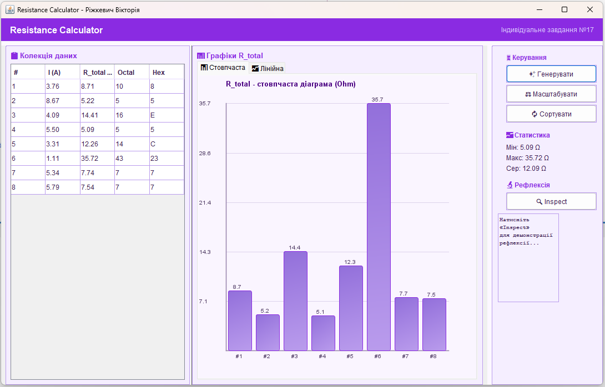
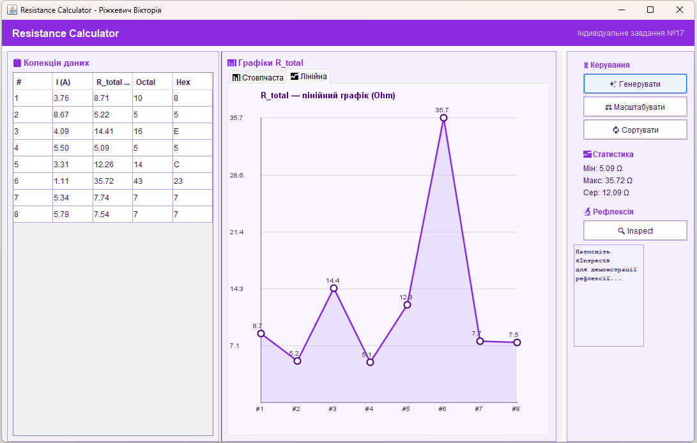
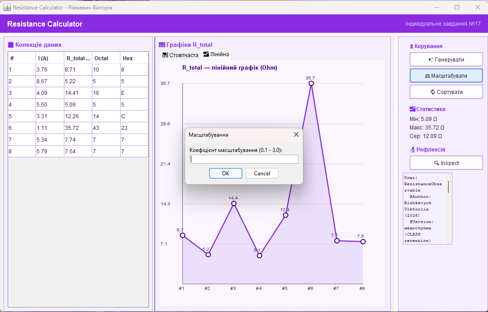
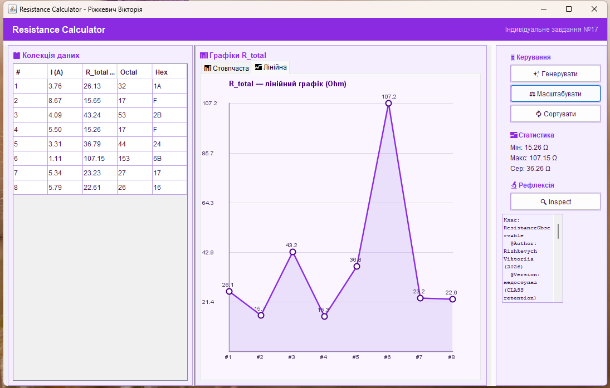
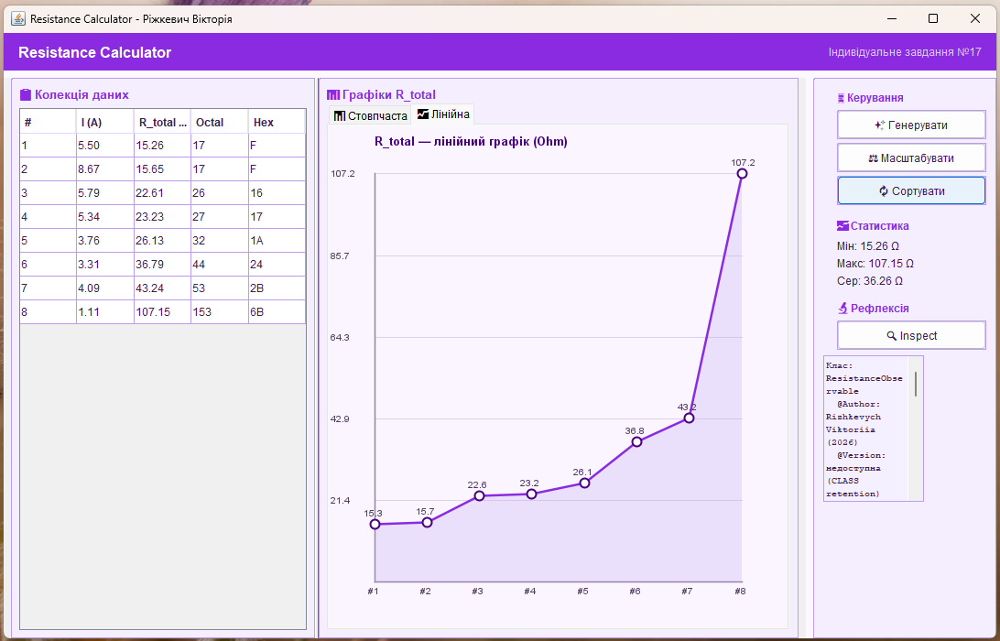
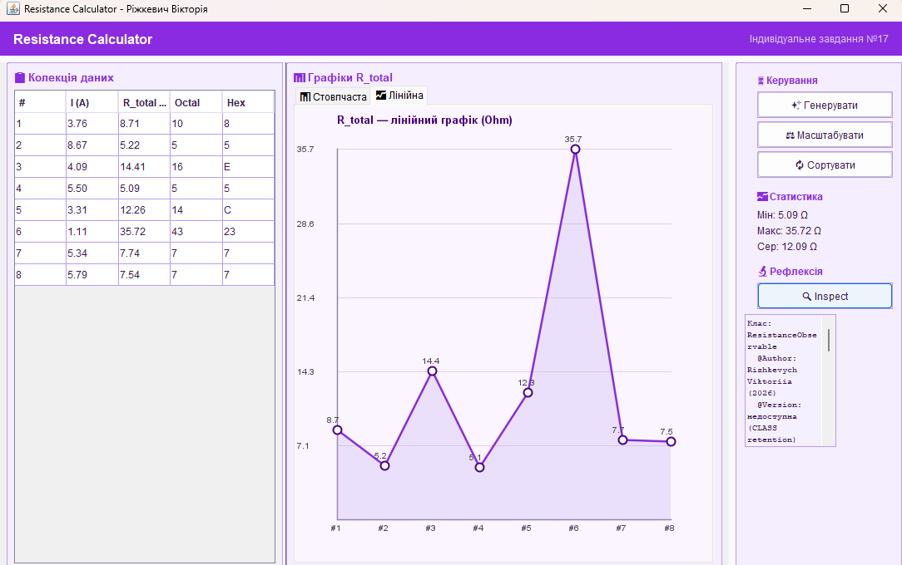
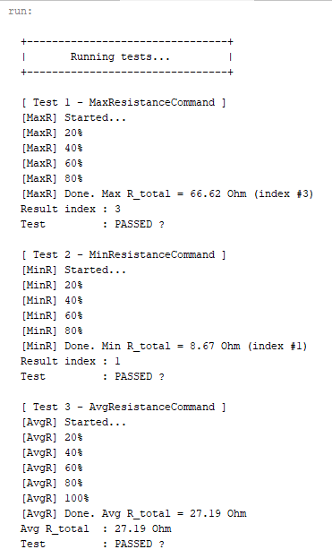
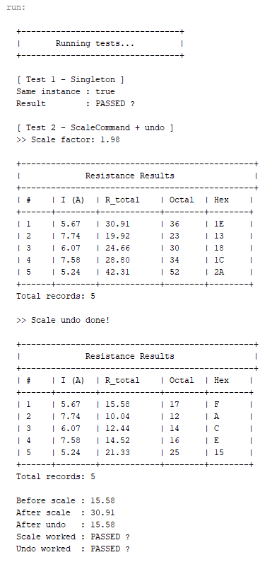

<div align="center">

# 🌸 Завдання 7


</div>

---

> У цьому завданні реалізовано графічний інтерфейс з використанням шаблону
> Observer, анотацій з різними Retention policies та концепції рефлексії.
> Колекція опорів відображається у таблиці та на двох типах графіків,
> які автоматично оновлюються при будь-якій зміні даних.

---

## 🎀 Постановка задачі

### Індивідуальне завдання №17
Визначити **8-річне та 16-річне** уявлення цілісного значення загального
електричного опору трьох послідовно з'єднаних провідників при заданому
постійному струмі та відомій напрузі на кожному провіднику.

### Чотири обов'язкові частини

**Завдання 1** -  Розробити ієрархію класів відповідно до шаблону Observer (java) та продемонструвати можливість обслуговування розробленої раніше колекції (об'єкт, що спостерігається, Observable) різними (не менше двох) спостерігачами (Observers) – відстеження змін, упорядкування, висновок, відображення і т.д.

**Завдання 2** - При реалізації ієрархії класів використати інструкції (Annotation). Відзначити особливості різних політик утримання анотацій (annotation retention policies). Продемонструвати підтримку класів концепції рефлексії (Reflection).

**Завдання 3** - Використовуючи раніше створені класи, розробити додаток, що відображає результати обробки колекції об'єктів у графічному вигляді

**Завдання 4** - Забезпечити діалоговий інтерфейс з користувачем та перемальовування графіка під час зміни значень елементів колекції.

---

## 💜 Про програму

Програма об'єднує всі попередні проекти в єдиний графічний додаток.
Клас `ResistanceObservable` зберігає колекцію та сповіщає трьох спостерігачів
при кожній зміні даних. `TableObserver` миттєво оновлює таблицю,
`ChartObserver` перемальовує обидва графіки, а лямбда-спостерігач
оновлює панель статистики. Анотації демонструють три різні політики
утримання, а клас `ReflectionDemo` читає їх.

---

## 📁 Структура проекту
```
├── img
│   ├── gui.png
│   ├── charts.png
│   ├── reflect.png
│   └── tests.png
├── src
│   ├── domain
│   │   ├── command
│   │   │   ├── Application.java       ← Singleton
│   │   │   ├── Command.java           ← інтерфейс команди
│   │   │   ├── ConsoleCommand.java    ← інтерфейс консольної команди
│   │   │   ├── ExecuteCommand.java    ← запуск потоків
│   │   │   ├── GenerateCommand.java   ← генерація даних
│   │   │   ├── Menu.java              ← макрокоманда
│   │   │   ├── RestoreCommand.java    ← відновлення
│   │   │   ├── SaveCommand.java       ← збереження
│   │   │   ├── ScaleCommand.java      ← масштабування + undo
│   │   │   ├── SortCommand.java       ← сортування + undo
│   │   │   ├── UndoCommand.java       ← скасування
│   │   │   └── ViewCommand.java       ← перегляд
│   │   ├── core
│   │   │   ├── ResistanceCalculator.java  ← обчислення опору
│   │   │   └── ResistanceData.java        ← модель даних
│   │   ├── observer
│   │   │   ├── AppAnnotations.java    ← НОВЕ: 3 анотації (RUNTIME/CLASS/SOURCE)
│   │   │   ├── ChartObserver.java     ← НОВЕ: спостерігач графіків
│   │   │   ├── ReflectionDemo.java    ← НОВЕ: демонстрація рефлексії
│   │   │   ├── ResistanceObservable.java ← НОВЕ: Observable
│   │   │   ├── ResistanceObserver.java   ← НОВЕ: інтерфейс Observer
│   │   │   └── TableObserver.java     ← НОВЕ: спостерігач таблиці
│   │   ├── thread
│   │   │   ├── AvgResistanceCommand.java  ← середнє значення
│   │   │   ├── CommandQueue.java          ← Worker Thread
│   │   │   ├── MaxResistanceCommand.java  ← пошук максимуму
│   │   │   ├── MinResistanceCommand.java  ← пошук мінімуму
│   │   │   └── Queue.java                ← інтерфейс черги
│   │   └── view
│   │       ├── View.java              ← інтерфейс відображення
│   │       ├── ViewResult.java        ← базова колекція
│   │       ├── ViewTable.java         ← таблична колекція
│   │       ├── Viewable.java          ← інтерфейс фабрики
│   │       ├── ViewableResult.java    ← ConcreteCreator
│   │       └── ViewableTable.java     ← ConcreteCreator+
│   └── test
│       ├── Main.java                  ← консольна точка входу
│       ├── MainGUI.java               ← НОВЕ: графічний інтерфейс
│       └── ResistanceTest.java        ← тестування
├── .gitignore
└── README.md
```

---

## 🗂️ Шаблон Observer

### Ієрархія класів

| Роль | Клас | Опис |
|------|------|------|
| Observable | `ResistanceObservable` | Зберігає колекцію, сповіщає спостерігачів |
| Observer (інтерфейс) | `ResistanceObserver` | Метод `update(items)` |
| Observer 1 | `TableObserver` | Оновлює JTable |
| Observer 2 | `ChartObserver` | Перемальовує bar і line графіки |
| Observer 3 | лямбда в `MainGUI` | Оновлює статистику min/max/avg |
---

## 🏷️ Анотації та Retention policies

У проекті реалізовано три анотації з різними політиками утримання:

### RUNTIME — `@Author`
```java
@Retention(RetentionPolicy.RUNTIME)  // доступна через Reflection
@Target({ElementType.TYPE, ElementType.METHOD})
public @interface Author {
    String name() default "Rizhkevych Viktoriia";
    String date() default "2026";
}
```
Зберігається у `.class` файлі **і** завантажується у JVM.
Reflection може прочитати її під час виконання програми.

### CLASS — `@Version`
```java
@Retention(RetentionPolicy.CLASS)
@Target(ElementType.TYPE)
public @interface Version {
    String value() default "1.0";
}
```
Зберігається у `.class` файлі, але **не** завантажується у JVM.
Reflection її не бачить — використовується інструментами байткоду.

### SOURCE — `@Todo`
```java
@Retention(RetentionPolicy.SOURCE)
@Target(ElementType.METHOD)
public @interface Todo {
    String value() default "";
}
```
Існує лише у вихідному коді. Компілятор видаляє її -
не потрапляє ні у `.class` ні у JVM.

---

## 🔬 Рефлексія (Reflection)

Клас `ReflectionDemo` зчитує анотації класів через Reflection API.
У GUI кнопка **«🔍 Inspect»** демонструє результати:
```java
// Читаємо RUNTIME анотацію  вона доступна
Author author = clazz.getAnnotation(Author.class);
// → name: Rizhkevych Viktoriia, date: 2026

// CLASS анотація - Reflection не бачить
// → повертає null

// SOURCE анотація - зникла при компіляції
// → повертає null
```

---

## 🖥️ Графічний інтерфейс

Вікно розміром **1100×700** містить чотири зони:

| Зона | Вміст |
|------|-------|
| Верхня панель | Заголовок програми |
| Ліва панель | Таблиця з колекцією (Observer 1) |
| Центральна панель | Вкладки з графіками (Observer 2) |
| Права панель | Кнопки керування, статистика (Observer 3), рефлексія |

### Кнопки керування

| Кнопка | Дія |
|--------|-----|
| ✨ Генерувати | Створює 8 нових записів |
| ⚖ Масштабувати | Запитує коефіцієнт і масштабує R_total |
| 🔃 Сортувати | Сортує за зростанням R_total |
| 🔍 Inspect | Демонструє рефлексію анотацій |

---

## 📸 Скріншоти виконання

### 📸 1 - Головне вікно після генерації
> Запущено програму, натиснуто «✨ Генерувати» - таблиця заповнена
> 8 записами, стовпчаста діаграма відображає R_total кожного елемента,
> панель статистики показує мін/макс/середнє.



---

### 📸 2 - Лінійний графік
> Вкладка «📈 Лінійна» - той самий набір даних відображено
> у вигляді лінійного графіка з точками та заливкою під лінією.



---

### 📸 3 - Введення коефіцієнта масштабування
> Натиснуто «⚖ Масштабувати» - програма запитує коефіцієнт.
> Введено значення **3** — всі значення R_total будуть помножені на 3.



---

### 📸 4  Результат масштабування
> Після підтвердження коефіцієнта 3 всі три спостерігачі отримали
> сповіщення одночасно: таблиця оновилась, графік перемалювався,
> статистика перерахувалась - це і є шаблон Observer у дії.



---

### 📸 5 - Сортування колекції
> Натиснуто «🔃 Сортувати» — колекція впорядкована за зростанням R_total.
> На графіку видно що стовпці тепер ідуть від найнижчого до найвищого,
> таблиця також оновилась у правильному порядку.



---

### 📸 6 - Панель рефлексії після Inspect
> Натиснуто «🔍 Inspect» — клас ReflectionDemo зчитав анотації
> через Reflection API. Видно що @Author (RUNTIME) прочиталась успішно,
> а @Version (CLASS) та @Todo (SOURCE) недоступні — це демонструє
> різницю між трьома Retention policies.



---

### 📸 7 — Результати тестування
> Запущено ResistanceTest.java — всі тести пройшли успішно.





---

<div align="center">
Розроблено з 💜 | Ріжкевич Вікторія
</div>
