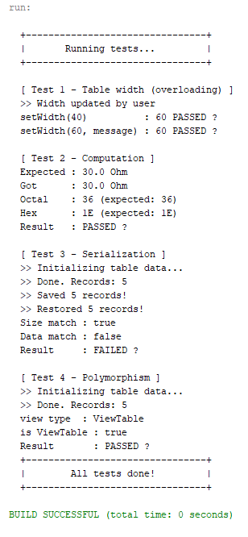

<div align="center">

# 🌸 Завдання 5


</div>

---

> У цьому завданні реалізовано обробку колекцій з використанням шаблонів
> проектування Command, Singleton та макрокоманди Menu.
> Додано підтримку скасування операцій (undo).

---

## 🎀 Постановка задачі

### Індивідуальне завдання №17
Визначити **8-річне та 16-річне** уявлення цілісного значення загального
електричного опору трьох послідовно з'єднаних провідників при заданому
постійному струмі та відомій напрузі на кожному провіднику.

### П'ять обов'язкових частин

**Завдання 1** - Реалізувати можливість скасування (undo) операцій (команд).

**Завдання 2** - Продемонструвати поняття "макрокоманда"

**Завдання 3** - При розробці програми використовувати шаблон Singletone.

**Завдання 4** - Забезпечити діалоговий інтерфейс із користувачем.

**Завдання 5** - Розробити клас для тестування функціональності програми.

---

## 💜 Про програму

Програма розширює попередній проект - додано архітектуру Command Pattern.
Кожна дія користувача є окремим об'єктом-командою. Клас Menu є макрокомандою -
він містить колекцію команд і делегує виконання відповідній команді.
Клас Application реалізує Singleton - існує лише один екземпляр програми.

---

## 📁 Структура проекту
```
├── img
│   ├── menu.png
│   ├── undo.png
│   └── tests.png
├── src
│   ├── domain
│   │   ├── ResistanceData.java        ← з попередніх проектів
│   │   ├── ResistanceCalculator.java  ← з попередніх проектів
│   │   ├── View.java                  ← з попередніх проектів
│   │   ├── Viewable.java              ← з попередніх проектів
│   │   ├── ViewableResult.java        ← з попередніх проектів
│   │   ├── ViewResult.java            ← з попередніх проектів
│   │   ├── ViewableTable.java         ← з попередніх проектів
│   │   ├── ViewTable.java             ← з попередніх проектів
│   │   ├── Command.java               ← НОВЕ: інтерфейс команди
│   │   ├── ConsoleCommand.java        ← НОВЕ: інтерфейс консольної команди
│   │   ├── Menu.java                  ← НОВЕ: макрокоманда
│   │   ├── Application.java           ← НОВЕ: Singleton
│   │   ├── ScaleCommand.java          ← НОВЕ: масштабування + undo
│   │   ├── SortCommand.java           ← НОВЕ: сортування + undo
│   │   ├── GenerateCommand.java       ← НОВЕ: генерація
│   │   ├── ViewCommand.java           ← НОВЕ: перегляд
│   │   ├── SaveCommand.java           ← НОВЕ: збереження
│   │   ├── RestoreCommand.java        ← НОВЕ: відновлення
│   │   └── UndoCommand.java           ← НОВЕ: скасування
│   └── test
│       ├── Main.java                  ← точка входу
│       └── ResistanceTest.java        ← тестування
├── .gitignore
└── README.md
```

---

## 🗂️ Шаблони проектування

### Singleton - Application
```java
// Єдиний екземпляр створюється при завантаженні класу
private static final Application INSTANCE = new Application();

// Закритий конструктор - ніхто не може створити другий екземпляр
private Application() {}

// Єдина точка доступу
public static Application getInstance() {
    return INSTANCE;
}
```
Завдяки Singleton гарантується що `Application` існує в єдиному екземплярі,
а доступ до нього можливий з будь-якої точки програми.

---

### Command - ієрархія команд

| Клас | Роль | Підтримує undo |
|------|------|:--------------:|
| `Command` | Інтерфейс команди | — |
| `ConsoleCommand` | Розширює Command, додає `getKey()` | — |
| `ScaleCommand` | Масштабує колекцію | ✓ |
| `SortCommand` | Сортує колекцію | ✓ |
| `GenerateCommand` | Генерує нові дані | — |
| `ViewCommand` | Виводить таблицю | — |
| `SaveCommand` | Серіалізує у файл | — |
| `RestoreCommand` | Відновлює з файлу | — |
| `UndoCommand` | Скасовує останню дію | — |

---

### Макрокоманда - Menu
Клас `Menu` реалізує `Command` і містить колекцію об'єктів `ConsoleCommand`.
Виклик `menu.execute()` запускає головний цикл і делегує виконання
відповідній команді зі списку - це і є макрокоманда.
```java
// Menu — колекція команд (макрокоманда)
menu.add(new ViewCommand(view));
menu.add(new GenerateCommand(view, history));
menu.add(new ScaleCommand(view, history));  // undo ✓
menu.add(new SortCommand(view, history));   // undo ✓
menu.add(new UndoCommand(history));

// Запуск макрокоманди
menu.execute();
```

---

### Undo - скасування операцій
Команди що підтримують undo зберігають копію стану колекції перед виконанням.
Виконані команди додаються до стеку `history`.
`UndoCommand` дістає останню команду зі стеку і викликає її `undo()`.
```java
// ScaleCommand.execute() — зберігає копію і додає себе до стеку
backup = new ArrayList<>(view.getItems()); // копія
history.push(this);                        // додаємо до стеку

// UndoCommand.execute() - скасовує останню команду
ConsoleCommand last = history.pop();
last.undo(); // відновлює копію
```

---

## 🖥️ Команди діалогу

| Команда | Дія | Undo |
|---------|-----|:----:|
| `v` | Переглянути таблицю | — |
| `g` | Згенерувати нові дані | — |
| `c` | Масштабувати колекцію | ✓ |
| `o` | Сортувати за R_total | ✓ |
| `s` | Зберегти у файл | — |
| `r` | Відновити з файлу | — |
| `u` | Скасувати останню дію | — |
| `q` | Вийти | — |

---

## 📸 Скріншоти виконання

### 📸 1 - Меню та робота з командами


---

### 📸 2 - Демонстрація undo


---

### 📸 3 - Результати тестування


---

<div align="center">
Розроблено з 💜 | Ріжкевич Вікторія
</div>
