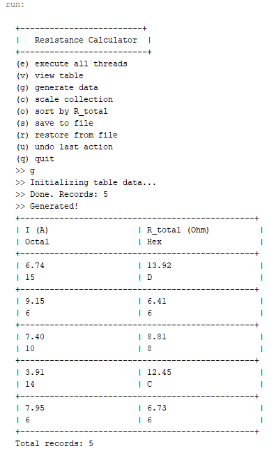
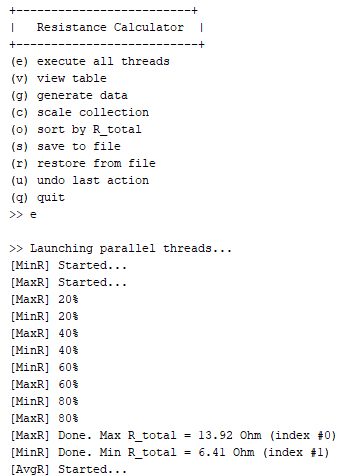
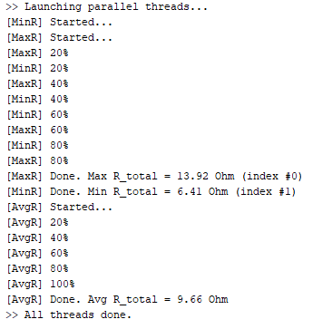

<div align="center">

# 🌸 Завдання 6


</div>

---

> У цьому завданні реалізовано паралельну обробку колекції об'єктів
> з використанням шаблону Worker Thread. Три завдання виконуються
> паралельно у двох чергах — пошук мінімуму, максимуму та середнього значення R_total.

---

## 🎀 Постановка задачі

### Індивідуальне завдання №17
Визначити **8-річне та 16-річне** уявлення цілісного значення загального
електричного опору трьох послідовно з'єднаних провідників при заданому
постійному струмі та відомій напрузі на кожному провіднику.

### Три обов'язкові частини

**Завдання 1** - Продемонструвати можливість паралельної обробки елементів колекції (пошук мінімуму, максимуму, обчислення середнього значення, відбір за критерієм, статистична обробка тощо).

**Завдання 2** - Управління чергою завдань (команд) реалізувати за допомогою шаблону Worker Thread.

---

## 💜 Про програму

Програма розширює попередній проект - додано три команди для паралельної
обробки колекції та клас CommandQueue що реалізує шаблон Worker Thread.
Команда `e` запускає два обробники черги одночасно і розподіляє між ними
три завдання. Програма очікує завершення всіх потоків перед поверненням до меню.

---

## 📁 Структура проекту
```
├── img
│   ├── threads.png
│   ├── parallel.png
│   └── tests.png
├── src
│   ├── domain
│   │   ├── ResistanceData.java           ← з попередніх проектів
│   │   ├── ResistanceCalculator.java     ← з попередніх проектів
│   │   ├── View.java                     ← з попередніх проектів
│   │   ├── Viewable.java                 ← з попередніх проектів
│   │   ├── ViewableResult.java           ← з попередніх проектів
│   │   ├── ViewResult.java               ← з попередніх проектів
│   │   ├── ViewableTable.java            ← з попередніх проектів
│   │   ├── ViewTable.java                ← з попередніх проектів
│   │   ├── Command.java                  ← з попередніх проектів
│   │   ├── ConsoleCommand.java           ← з попередніх проектів
│   │   ├── Menu.java                     ← з попередніх проектів
│   │   ├── Application.java              ← з попередніх проектів
│   │   ├── ScaleCommand.java             ← з попередніх проектів
│   │   ├── SortCommand.java              ← з попередніх проектів
│   │   ├── GenerateCommand.java          ← з попередніх проектів
│   │   ├── ViewCommand.java              ← з попередніх проектів
│   │   ├── SaveCommand.java              ← з попередніх проектів
│   │   ├── RestoreCommand.java           ← з попередніх проектів
│   │   ├── UndoCommand.java              ← з попередніх проектів
│   │   ├── Queue.java                    ← НОВЕ: інтерфейс черги
│   │   ├── CommandQueue.java             ← НОВЕ: Worker Thread
│   │   ├── MaxResistanceCommand.java     ← НОВЕ: пошук максимуму
│   │   ├── MinResistanceCommand.java     ← НОВЕ: пошук мінімуму
│   │   ├── AvgResistanceCommand.java     ← НОВЕ: середнє значення
│   │   └── ExecuteCommand.java           ← НОВЕ: запуск потоків
│   └── test
│       ├── Main.java                     ← оновлений
│       └── ResistanceTest.java           ← 6 нових тестів
├── .gitignore
└── README.md
```

---

## 🗂️ Шаблон Worker Thread

### Як це працює

Клас `CommandQueue` створює внутрішній клас `Worker` що виконується
в окремому потоці. Worker безперервно перевіряє чергу та виконує
команди одну за одною. Клієнту достатньо лише покласти завдання у чергу.
```
Клієнт                CommandQueue              Worker (окремий потік)
   |                       |                           |
   |--- put(minCmd) ------>|                           |
   |--- put(maxCmd) ------>|                           |
   |                       |<--- take() --------------|
   |                       |---- minCmd.execute() ---->|
   |                       |<--- take() --------------|
   |                       |---- maxCmd.execute() ---->|
```

### Розподіл завдань між двома чергами
```java
// Черга 1 - виконує MinResistanceCommand
CommandQueue queue1 = new CommandQueue();
queue1.put(minCmd);

// Черга 2 - виконує MaxResistanceCommand, потім AvgResistanceCommand
CommandQueue queue2 = new CommandQueue();
queue2.put(maxCmd);
queue2.put(avgCmd);

// Головний потік очікує завершення всіх трьох
while (minCmd.running() || maxCmd.running() || avgCmd.running()) {
    TimeUnit.MILLISECONDS.sleep(100);
}
```

Завдяки двом чергам `min` та `max+avg` виконуються **паралельно** -
кожна черга має свій власний Worker у окремому потоці.

---

## 🔍 Нові класи

| Клас | Роль |
|------|------|
| `Queue` | Інтерфейс черги - методи `put` та `take` |
| `CommandQueue` | Реалізує Worker Thread — черга + внутрішній Worker |
| `MaxResistanceCommand` | Завдання: пошук максимального R_total |
| `MinResistanceCommand` | Завдання: пошук мінімального R_total |
| `AvgResistanceCommand` | Завдання: середнє арифметичне R_total |
| `ExecuteCommand` | Консольна команда — створює черги та запускає потоки |

---

## 🖥️ Команди діалогу

| Команда | Дія |
|---------|-----|
| `v` | Переглянути таблицю |
| `g` | Згенерувати нові дані |
| `c` | Масштабувати колекцію |
| `o` | Сортувати за R_total |
| `s` | Зберегти у файл |
| `r` | Відновити з файлу |
| `u` | Скасувати останню дію |
| `e` | Запустити всі потоки паралельно |
| `q` | Вийти |

---

## 📸 Скріншоти виконання

### 📸 1 - Запуск потоків з меню




---

### 📸 2 - Паралельне виконання потоків


---

### 📸 3 - Результати тестування


---

<div align="center">
Розроблено з 💜 | Ріжкевич Вікторія
</div>
